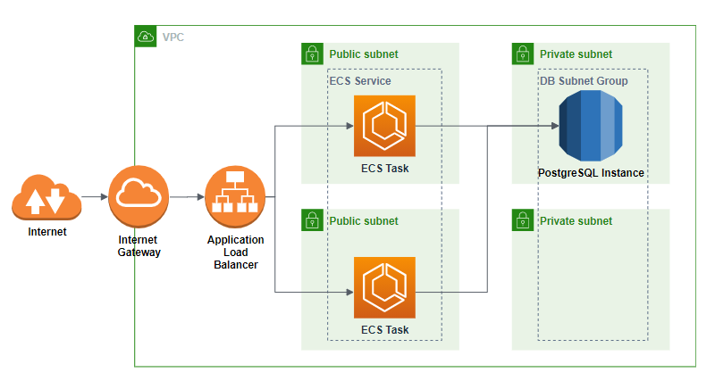

# Orca App
A python service that logs unique access to the service. The service uses PostgreSQL as a datastore
and expects the URL and the credentials to be passed in the DATABASE_URL environment
variable.
The service itself has 2 endpoints (in app.py), one for the service itself and the other
one for the healthcheck.

# Architecture

The service runs on docker containers in ECS Fargate. It is deployed in us-east-2 in 2 different subnets. It is front-ended by an application load balancer which is made public facing by an internet gateway.
There is an instance of PostgreSQL database hosted in RDS.

# Improvements
Due to time/other constraints, a lot of what could not be achieved as part of this exercise have been listed in the [Improvements Doc](Orca_Improvements.docx).